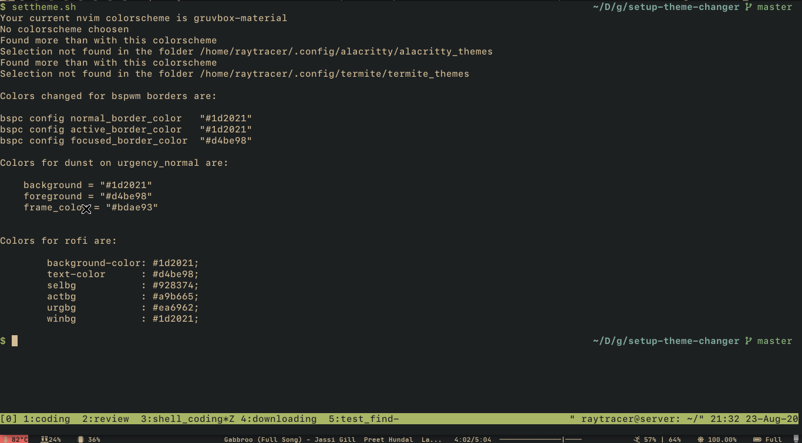

# setup-theme-changer

Makes theme changing more fun and less time taking.

Just select the theme and it'll change it for every tools you use.

Watch this little demo:



## currently supported tools

* **terminals:**
	- alacritty
	- termite
	- urxvt
* **Xresources:**
	- urxvt
	- polybar
* **Laucher:**
	- rofi
* **Notification Daemon**:
	- dunst

> Support for dmenu will come soon


```
Note:
	This theme is heavily based on my setup of how keep my dotfiles.
	You also have to keep the colorschemes as individual file and base config(other config settings) on second file.
	To see how to do it, visit the below links.

	Also, only tools to which links are provided below require this type of seperate configuration.

	Reminding you, always keep backup of your config files.
```

* [alacritty](https://github.com/coolabhays/my-config-files/tree/master/.config/alacritty)
* [termite](https://github.com/coolabhays/my-config-files/tree/master/.config/termite)
* [Xresources](https://github.com/coolabhays/my-config-files/tree/master/.config/xresources_colors)


## dependencies:

* gnu-sed
* fzf
* find
* tools which you want to change theme of
